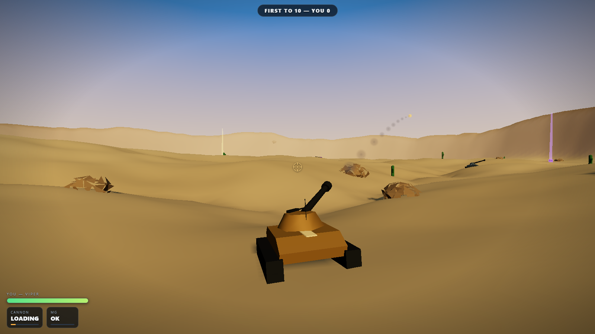
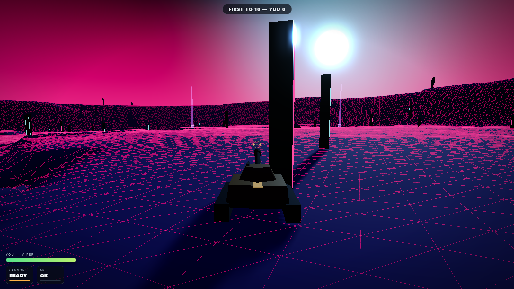
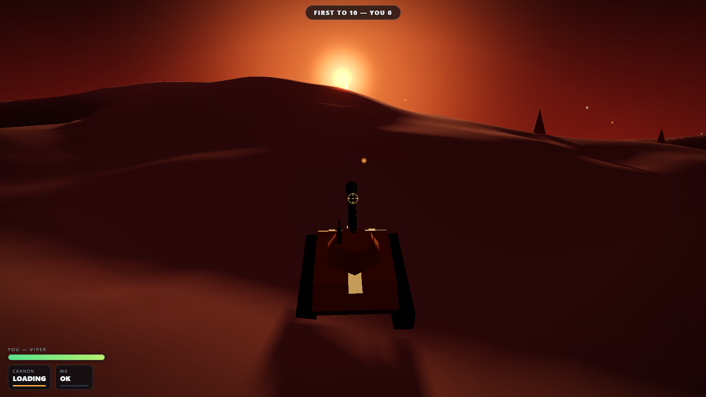

# IRON VOLLEY

**3D multiplayer tank artillery combat.** Arc shells over hills, hose them down
with the mounted machine gun up close, and scavenge the battlefield for rounds
that should probably be illegal.



| | |
|---|---|
|  |  |

## Play

```bash
npm install
npm start          # → http://localhost:8137
```

No build step. Three.js via import map, everything else is hand-rolled.

## Modes

- **SOLO OPS** — you against 1–7 computer-controlled tanks (Recruit / Veteran / Warlord)
- **SPLIT-SCREEN VERSUS** — two commanders on one keyboard, with optional bots in the mix

## Controls

| | Player 1 | Player 2 |
|---|---|---|
| Drive | `W` `A` `S` `D` | Arrow keys |
| Turret | `Q` / `E` | `,` / `.` |
| Barrel elevation | `R` / `F` | `'` / `;` |
| Fire cannon | `Space` | `Enter` |
| Machine gun (hold) | `Left Shift` | `/` |
| Camera (1st / 3rd person) | `C` | `P` |

The cannon is ballistic — raise the barrel and lob shells **over** the terrain.
The machine gun is hitscan for close-quarters brawls, and it overheats.

## Tanks

| Tank | Role | Character |
|---|---|---|
| **JACKAL** | Scout | Fastest hull, paper armor |
| **VIPER** | Skirmisher | The balanced all-rounder |
| **BASTION** | Heavy | Slow rolling fortress, 175 HP |
| **LONGBOW** | Artillery | Highest muzzle velocity, outranges everything |

## Maps

1. **Dune Sea** — golden ridgelines and deep sand bowls
2. **Frostline** — a glacial valley with a frozen lake, falling snow, black pines
3. **Verdant Vale** — emerald downs cut by a river, standing stones
4. **Cinder Peak** — a live volcano, lava channels, drifting embers
5. **Neon Rift** — terraced synthwave canyon, glowing grid, void sky

## Discoverable rounds

Glowing beacon crates spawn across the map. Drive through one to load:

- **SCATTER** — bursts into 9 bomblets
- **LANCE** — instant hitscan laser
- **NUKE** — one round. You'll know.
- **INFERNO** — incendiary, leaves burning ground that cooks anyone inside
- **SINGULARITY** — gravity well that drags tanks (and bends incoming shells)

First to 10 kills takes the field.

## Tests

```bash
npm run shots      # Playwright: screenshot every map + menu, fail on console errors
npm run playtest   # headless all-bot war: 21 functional checks across all maps
```

Built with Claude Code (Fable 5) + Codex CLI (audio synth + particle effects + adversarial review).
